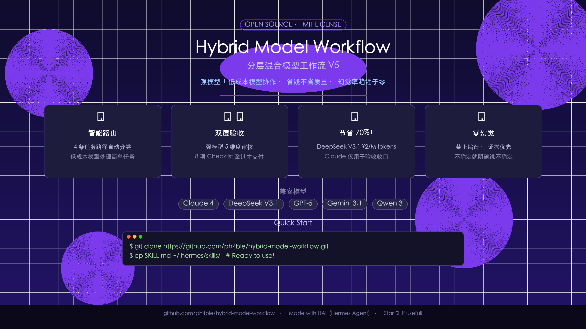
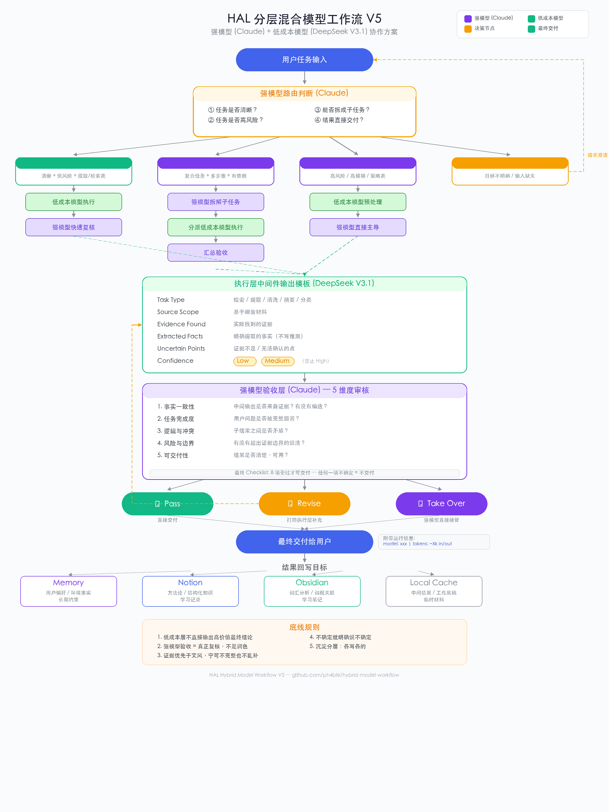

# HAL 分层混合模型工作流



强模型 + 低成本模型分层协作方案，适用于 [Hermes Agent](https://github.com/hermes-ai/hermes-agent) 及任何多模型编排场景。

## 核心理念

不是所有任务都值得用最贵的模型。这套工作流把任务按复杂度分层：
- **强模型**（Claude / GPT-5）：负责理解、拆解、判断、最终校验
- **低成本模型**（DeepSeek V3.1 / Gemini Flash）：负责检索、提取、清洗、摘要

低成本模型只产出中间件，不主导最终结论；强模型对所有交付结果负责。

## 工作流全景



## 特性

- ⚡ **智能路由** — 4 条任务路径自动分类（直接执行 / 先拆解 / 强模型主导 / 信息不足）
- 🛡️ **双层验收** — 强模型 5 维度审核 + 8 项 Checklist 全过才交付
- 💰 **节省 70%+** — 低成本模型 ¥2/M tokens，强模型仅用于验收收口
- 🔒 **零幻觉** — 禁止编造 · 证据优先 · 不确定就明确说不确定
- 🔌 **模型无关** — 兼容 Claude、DeepSeek、GPT-5、Gemini、Qwen 等

## 包含内容

- 📋 四种任务路由规则（Route A-D）
- 📝 低成本执行层 Prompt 模板
- ✅ 强模型 Reviewer Prompt 模板
- 🔍 最终校验 Checklist（8 维度）
- ⚙️ Hermes Agent 配置方法
- 📦 结果回写规则

## 快速开始

### 安装为 Hermes Skill

```bash
# 克隆到 Hermes skills 目录
mkdir -p ~/.hermes/skills/mlops
git clone https://github.com/ph4ble/hybrid-model-workflow.git ~/.hermes/skills/mlops/hybrid-model-workflow
```

### 配置

1. 在 `~/.hermes/config.yaml` 添加低成本模型 provider
2. 可选启用 smart_model_routing
3. 详见 [SKILL.md](./SKILL.md) 中的配置说明

## 迭代历史

| 版本 | 重点 |
|------|------|
| V1 | 分层架构，ABCD 任务分类 |
| V2 | 小模型强约束 + 强模型校验 |
| V3 | 可执行工作流规范 |
| V4 | 真实工作流蓝图（路由器、中间件、回写） |
| V6 | 系统提示词 + Hermes 配置 + 运行信息显示 |

## License

MIT
